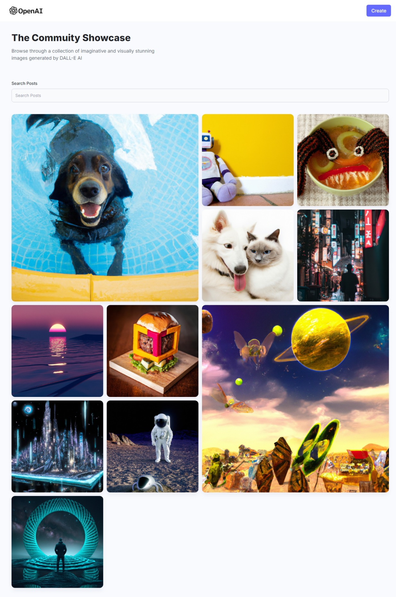
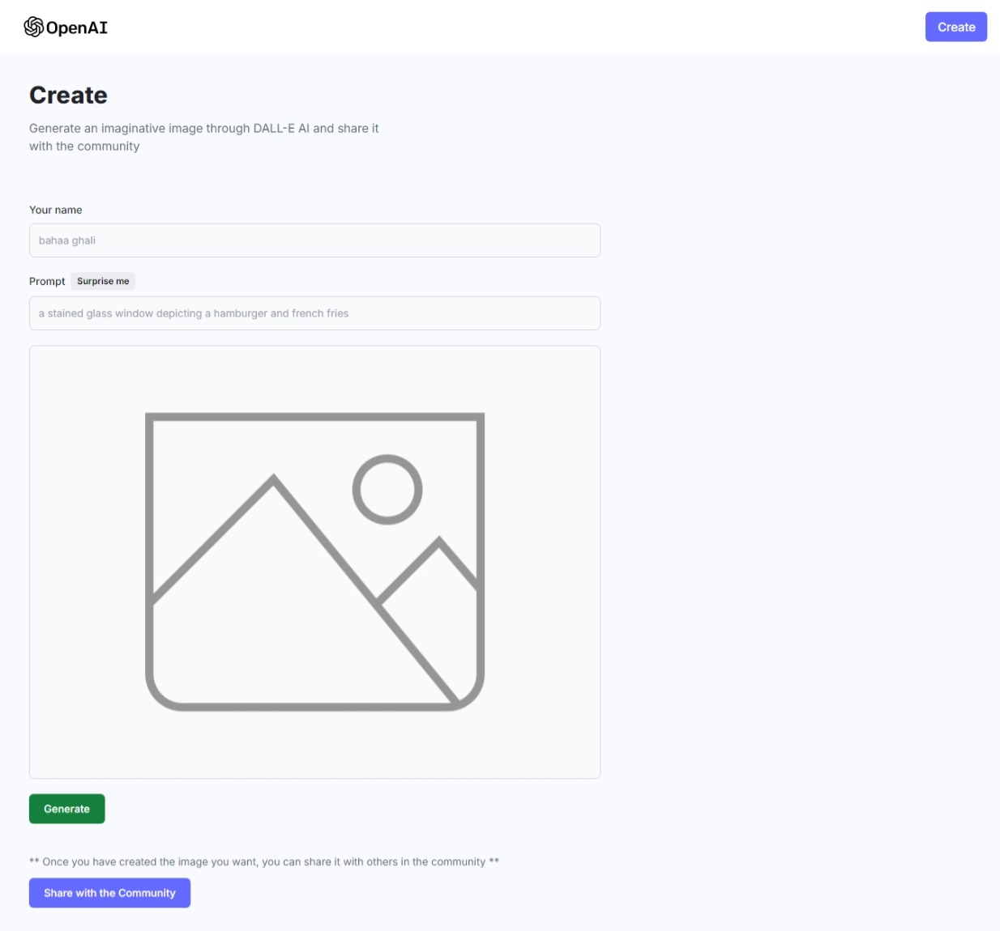

# mern-stack-dall-e-clone

## Introduction

This project is a clone of DALL-E 2.0, an image generation model developed by OpenAI. It utilizes the MERN stack to create a web application that allows users to explore and generate unique images using advanced generative techniques.

<h2>Demo</h2>
You can try out the game here: <a href="https://dall-e-bahaaghali000.vercel.app/">DALL-E 2.0 Clone</a>

## Features

- Explore and generate unique images.
- User-friendly interface powered by React.js.
- Secure user authentication using JWT tokens.
- MongoDB database for storing user data and image information.
- RESTful API built with Express.js.
- Seamless integration of the latest DALL-E 2.0 model.
